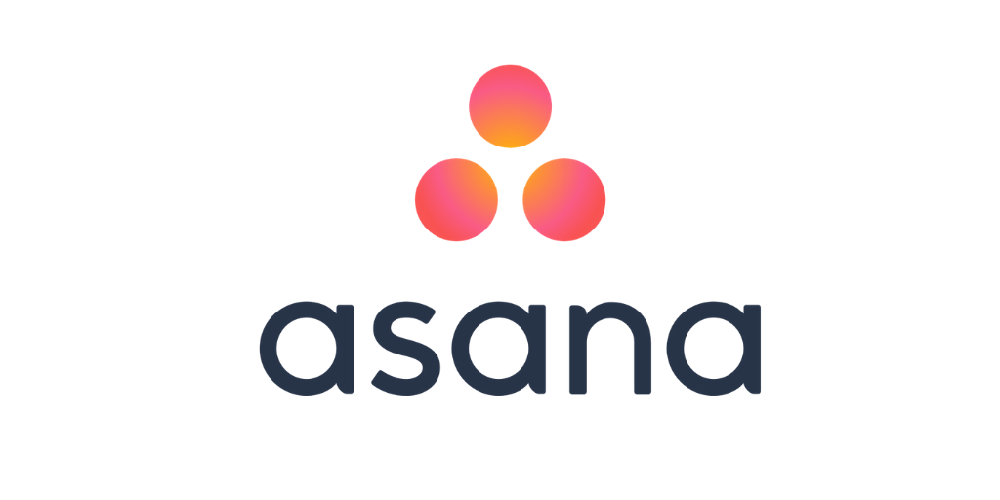

# Asana

LAST UPDATED: Feb. 4, 2021

Asana

### Author 

Ni Xu, [ni@usdigitalresponse.org](mailto:ni@usdigitalresponse.org), please reach out to Ni if you have any questions.

Kristen Eberlin, [kristen@usdigitalresponse.org](mailto:kristen@usdigitalresponse.org) 

[https://asana.com](https://www.google.com/url?q=https://asana.com&sa=D&source=editors&ust=1612549022637000&usg=AOvVaw2yfjYYreHOdAPJsA3AwM1m) 

‌

## Description 

Asana is a web and mobile application designed to help teams organize, track, and manage their work. Forrester, Inc. reports that “Asana simplifies team-based work management.”

## Tags 

‌

* 🌈 No-code
* 💸 Freemium
* 💰 Paid
* 🥁 Trial
* 📋 Project Management
* ♿ Accessible
* 🌐 Supports multiple languages

‌

## Category 

* Data/Productivity
* Forms
* Productivity
* User Communication

‌

#### Other Sub-Categories: 

N/A

## Procurement 

The basic tier is free. It also offers Premium, Business, and Enterprise tiers.

Asana offers a discount for governments and non-profit organizations. However, some government agencies may have to go through third-party vendors for fast-track procurement and may not be able to take advantage of the non-profit discount.

Click this link to find the latest pricing options: [https://asana.com/pricing](https://www.google.com/url?q=https://asana.com/pricing&sa=D&source=editors&ust=1612549022640000&usg=AOvVaw0DsLgf6CMwb5FVkzt8Okij) 

## Alternative / Similar Tools 

Microsoft Project, [https://www.microsoft.com/en-us/microsoft-365/project/project-management-software](https://www.google.com/url?q=https://www.microsoft.com/en-us/microsoft-365/project/project-management-software&sa=D&source=editors&ust=1612549022641000&usg=AOvVaw316pGrTK9-XwceZ0q-IZYh)

Jira, [https://www.atlassian.com/software/jira](https://www.google.com/url?q=https://www.atlassian.com/software/jira&sa=D&source=editors&ust=1612549022642000&usg=AOvVaw1AXHuexTo2y65mVvGa9cj5) 

Trello, [https://trello.com/](https://www.google.com/url?q=https://trello.com/&sa=D&source=editors&ust=1612549022642000&usg=AOvVaw1iLwi0vZJT84puwnR2hKJ_) 

‌

## Integration With Other Tools 

What tools, platforms does it integrate well with, not well with, or unknown?

‌Microsoft Teams, Salesforce, Gmail, Outlook, Slack, Zoom, Jira, Miro, Figma

See the full list here: [https://asana.com/apps](https://www.google.com/url?q=https://asana.com/apps&sa=D&source=editors&ust=1612549022643000&usg=AOvVaw2KSHE-mLvZ7vKuCNqTL9hB) 

## Vendor Support 

‌What kind of support can we expect from the vendor?

‌Asana Advisors can provide onboarding support and answer more specific product questions.

## Maintenance 

This tool does NOT require a technical team to maintain it after handoff.

### Monitoring 

‌How easy is it to detect and address errors and issues? How reliable is the tool when left alone?

It’s easy to [report issues online](https://www.google.com/url?q=https://forum.asana.com/t/how-to-report-a-bug/37734&sa=D&source=editors&ust=1612549022644000&usg=AOvVaw3ssJpLkYhYZ5INBKRBRLfx). The product is very reliable when left alone.

‌

## Security Level 

The security level is: MEDIUM SECURITY - Information or data that is used for USDR internal purposes but should not be disclosed to unauthorized parties outside of USDR. Does not contain personal data or intellectual property information and has no potential legal or regulatory impacts

‌

## How I've Used This Tool 

I have used Asana to manage multiple ongoing projects with different personnel. I create multiple teams, assign users with different roles that restrict edit/access to certain project details. I create a task under each project, assign it to a team member, and add the due date. I create custom fields based on the nature of a project. I receive notifications when someone assigns me a task or tags me in a comment. I upload files and images to a task to share updates with team members. I also create private projects that can be only accessed by me. I create and publish forms for other users to enter information into projects.

## Tips & Tricks \(from USDR users\) 

1. The third-party app integration is handy. I use [Slack integration](https://www.google.com/url?q=https://asana.com/apps&sa=D&source=editors&ust=1612549022646000&usg=AOvVaw04c6X7ROMczVEhjhcTjCdw). When someone assigns me a new task or tags me in a comment, I receive a real-time notification in Slack. I can directly respond to an assignment or a comment in Slack without having to open Asana.
2. I check my [Inbox](https://www.google.com/url?q=https://asana.com/guide/help/fundamentals/inbox&sa=D&source=editors&ust=1612549022646000&usg=AOvVaw0Q14DxuhLI51B8Bp3Tye9y) regularly so that I keep track of tasks I’m assigned to or part of.  
3. To look for a specific task, I like using the [Search functionality](https://www.google.com/url?q=https://asana.com/guide/help/fundamentals/search&sa=D&source=editors&ust=1612549022647000&usg=AOvVaw3c-XiYobE5f5dW7GXMl46Y).

## Lessons Learned 

PROCEED! What this tool is great for...

1. It’s great for managing multiple projects with multiple teams.

BEWARE! What's hard to do with this tool…

1. None identified

‌

### Other Landmines 

1. None identified

‌

## Training Resources 

‌

[‌Asana Academy](https://www.google.com/url?q=https://academy.asana.com/&sa=D&source=editors&ust=1612549022648000&usg=AOvVaw0p0KAihvCKxIeoG2qqGDHQ) provides training. Asana also has advisors who can provide training.

--------------------------------------------------------------------------------------------------------------------

SHARE ADDITIONAL EXPERIENCE ABOUT THE TOOL:

So … you’ve used the tool based on this write-up. Would you like to see more info added based on your experience? Please add your information via this link.

