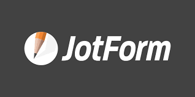

# JotForm



### Author 

Alex Allain, [alex@usdigitalresponse.org](mailto:alex@usdigitalresponse.org)

## Description 

‌A drag and drop form builder with light programmable capabilities.

## Tags 

* 🌈 No-code
* 🎁 Free
* 💸 Freemium
* 💰 Paid
* 🥁 Trial
* ♿ Accessible \(see [https://www.jotform.com/help/592-how-can-i-make-my-forms-accessible](https://www.google.com/url?q=https://www.jotform.com/help/592-how-can-i-make-my-forms-accessible&sa=D&ust=1611865562620000&usg=AOvVaw2WoScmQnOs0ikn5KZMIw6V) for how to enable accessibility checks\)
* 🌐 Supports multiple languages \(see [https://www.jotform.com/help/298-how-to-make-your-forms-multilingual](https://www.google.com/url?q=https://www.jotform.com/help/298-how-to-make-your-forms-multilingual&sa=D&ust=1611865562621000&usg=AOvVaw2oAtYEsxMQQKzKLcpKJzaB) for details\)

## Category 

* Data
* data/productivity
* Design
* Forms
* Services

## ‌Procurement 

‌JotForm has both free and paid tiers. The most expensive plan is $79/month, but is overkill for all but the most heavyweight use cases. The $29/month plan supports 10,000 form submissions, and will be sufficient in almost all cases. See [https://www.jotform.com/pricing](https://www.google.com/url?q=https://www.jotform.com/pricing&sa=D&ust=1611865562622000&usg=AOvVaw3TjLVYw3x7ipM7nqjz-CBz) for details.


Complimentary USDR license for internal testing only \(not for deployment\). [Request account access here](https://airtable.com/shrgI6dxsMqWbwId5).



Restricted USDR license for internal testing only \(not for deployment\). [Request account access and justify your need here](https://airtable.com/shrgI6dxsMqWbwId5). The USDR Operations & Tools team will review your request. 


## Alternative / Similar Tools 

* Cognito Forms
* Airtable Forms
* TypeForm

&lt;probably others&gt;

## Integration With Other Tools 

* Slack
* Zapier
* Power Automate \(requires a Premium Power Automate license\)
* AirTable

## Vendor Support 

I’ve never actually needed  to contact their support. There is a pretty rich amount of information available via Google as they have many forum posts. They appear to be quite responsive in that setting.

## Maintenance 

JotForm requires very little maintenance. While we have seen them experience the occasional outage, there’s not a great deal you need to do unless your form hits one of the paid plan limits.

### Monitoring 

JotForm can generally just be left on its own without hitting any issues, as long as you don’t hit one of the paid plan limits.

## Security Level 


PRIVATE / HIGH SECURITY - Information related to the USDR volunteers or government partners that, if disclosed, may lead to legal or regulatory repercussions including securities violations and mandated data breach reporting. May contain personal data with other related legal or regulatory privacy requirements or obligations. Improper or unauthorized collection, use, disclosure, retention, or disposal may pose some risk to the data subject.


Forms can be encrypted at rest, and some plans have PCI and HIPAA compliance. More details at [https://www.jotform.com/security/](https://www.jotform.com/security/)

## How I've Used This Tool 

* To import a PDF and use JotForm to fill out the PDF \(and then use Power Automate to link that PDF to SharePoint\)
* To build a number of wizard/screener flows that don’t actually anticipate a form being submitted at all, but instead use JotForm’s programmatic capabilities
* To build a number of longer, multi-page intake forms
* JotForm has many plugins, including the ability to do scheduling and take payment information, but I have not used those.
* [A Vote-by-Mail demo app](https://www.google.com/url?q=https://form.jotform.com/202688090585060&sa=D&ust=1611865562624000&usg=AOvVaw3qIK_HCg5eSJc_rGlHG62W) that fills in a PDF
* A [Election “Start-up” Wizard](https://www.google.com/url?q=https://form.jotform.com/202400674473046&sa=D&ust=1611865562625000&usg=AOvVaw3dxx4CxBPI7zOTPKYvmjs2) that isn’t actually intended to ever receive submissions

## Tips & Tricks

...

## Lessons Learned 


PROCEED! What this tool is great for:


For almost any basic form task, JotForm is quite good.

JotForm is a great tool to prototype any Form or Form-like flow to show what is possible to a government partner. Often, building a form is expected to be hard, but JotForm makes it easy. JotForm also makes it look good. Customizing JotForm to have the look-and-feel of our partners is pretty easy, and can make for a really quick win when creating a demo.

It is very easy to build a JotForm for a partner and then transfer the form to them by cloning the form through the “Create Form\|Import Form” workflow, so you don’t need to have access to their JotForm account just to build the form.

The “one question at a time” flow is very good for wizards/screeners.

JotForm makes it easy to integrate with AirTable \(and has more powerful form functionality - particularly the programmability - than AirTable\) as well as other tools, so it is a good module in a larger suite of SaaS tools.

JotForm has the ability to import a PDF, and then produce a filled version of that PDF. This can be a good way to quickly digitize the intake process for workflows that are currently paper based.


BEWARE! What's hard to do with this tool:


It is more difficult to build wizards/screening questions in the single page version of the form - but this is generally solvable by using the one-question-at-a-time process.

JotForm may not be a good tool if your partner already has access to a different form builder - e.g. Cognito Forms.

JotForm may not be a good fit if you only need to build simple forms, and you are using a product like AirTable \(or GSuite\) that has its own forms, and they are good enough for what you need to do. JotForm introduces another procurement hurdle, and another tool to integrate. That being said, JotForm’s user experience is also nice, so even in those cases, you find it is a good choice.

### Other Landmines 

Getting files uploaded to JotForm via Power Automate is very tedious and challenging.

## Training Resources 

I can’t recommend any because I never needed one. I find the JotForm UI to be pretty intuitive, and most questions can be answered by Googling.

## Hmm, What Else? 

‌In my opinion, JotForm is the go to form builder for USDR at the moment. While there might be better tools out there that we should consider, of all the form builders we’ve used, I think it’s the best.

